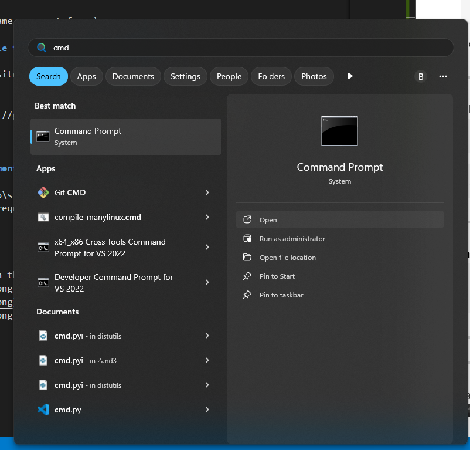
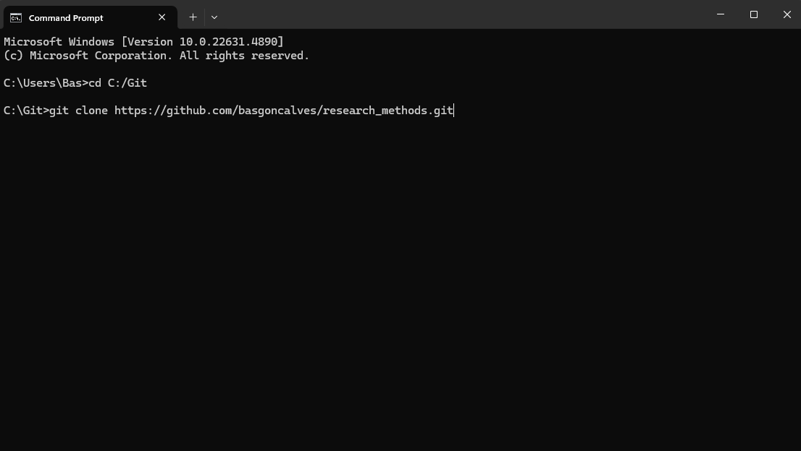
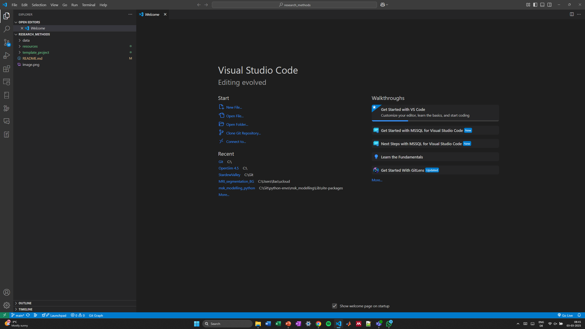
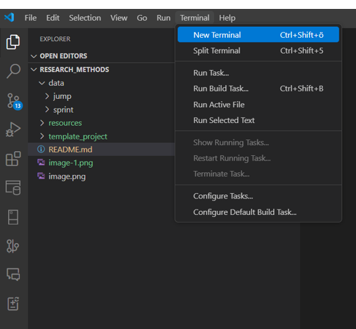
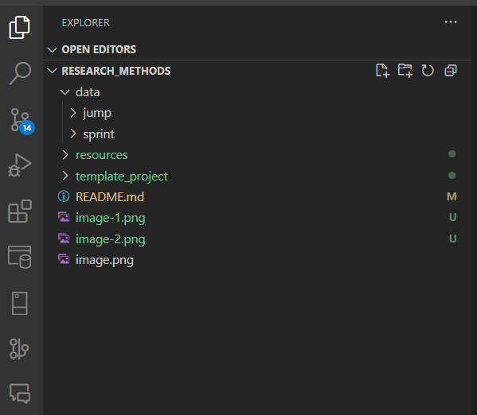

# 350084-1 SE MA1II - SpecializationCourse Quantitative Research Methods (2025S) 

**Author:** Basilio Goncalves, PhD, University of Vienna, 2025

Uspace
https://uspace.univie.ac.at/web/lehre/lehrveranstaltungdetail?lehrveranstaltungId=991145.28

Moodle
https://moodle.univie.ac.at/course/view.php?id=446235

Repository
https://github.com/basgoncalves/research_methods

**Requirements:**

* Computer with wifi
* Access to Python 
https://colab.research.google.com/drive/1MQPLlt6CuMSz0j0lU1y5y2Ny2YJ1f8Eh
* 


**Class Structure:**

* **Introduction:** Daily topic relevant methods
* **Activity Overview:** Explain the activity: each student will throw a ball 10 times, recording their success rate. Groups will then analyze the data using Python.
* **Individual learning (20 minutes)** Follow class guide individually or in groups
* **Group Discussion (15 minutes):** Share findings and discuss different approaches.
* **Conclusion (10 minutes):** Summarize key learnings and address any questions.


# 1. Setting up your project 


## Pre-requisites for Installation

1. **Download a Code Interpreter**  
    I recommend [Visual Studio Code](https://code.visualstudio.com/download), but use your preferred one.

2. **Download and Install Python (suggest 3.8)**  
    Make sure it is the correct bit version: [Python 3](https://www.python.org/downloads/release/python-3129/)

3. **Download and Install Git**  
    Download Git from [Git](https://git-scm.com/downloads) and follow the installation instructions.

4. **Undertand these basic terms**
* **Path Directory:** Where you save project files.
* **File Repository:** Storage for project files, usually a Git repo.
* **Version Control:** Tracks file changes over time.
* **Virtual Environment:** Isolated Python environment for managing dependencies.
* **Dependencies:** External libraries/packages needed for the project.


---

## Usage


1. **Create a Virtual Environment**
     ```sh
     cd 'path/on/your/computer/to/save/the /project' # make sure the path is not 
     python -m venv <myenv>
     ```
     Note: use any name you want for <\myenv>
     
     
---
2. **Clone this Module to your virtual environment**
   ```
   cd .\<myenv>\Lib\site-packages
   ```
     ```
     git clone https://github.com/basgoncalves/research_methods.git
     ```
---

3. **Install requirements**
     ```powershell
     cd .\<myenv>\Lib\site-packages\research_methods
     pip install -r requirements.txt
     ```
---

---
Start a new folder in the repository cloned




---