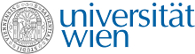

# 350084-1 SE MA1II - SpecializationCourse Quantitative Research Methods (2025S) 

Uspace
https://uspace.univie.ac.at/web/lehre/lehrveranstaltungdetail?lehrveranstaltungId=991145.28

Moodle
https://moodle.univie.ac.at/course/view.php?id=446235

Repository
https://github.com/basgoncalves/research_methods

**Requirements:**

* Computer with wifi
* Access to Python 
https://colab.research.google.com/drive/1MQPLlt6CuMSz0j0lU1y5y2Ny2YJ1f8Eh

**Class Structure:**

* **Introduction:** Daily topic relevant methods
* **Activity Overview:** Explain the activity: each student will throw a ball 10 times, recording their success rate. Groups will then analyze the data using Python.
* **Individual learning (20 minutes)** Follo
