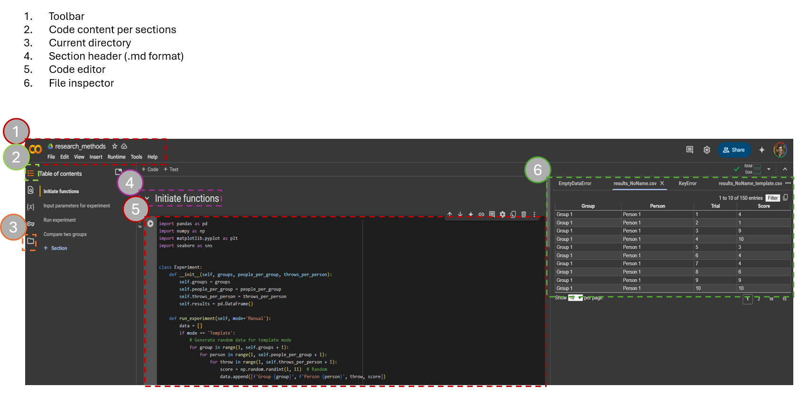

# Python Data Analysis Guide

Welcome to the Python Data Analysis Guide! This guide will help you get started with NumPy and Pandas, whether you are using Google Colab or a local Python environment.

## Getting Started

### Using Google Colab

1. Go to [Google Colab](https://colab.research.google.com/).
2. Sign in with your Google account.
3. Click on `New Notebook` to create a new Python notebook.

### Using Local Python Environment

1. Download and install [Python](https://www.python.org/downloads/).
2. Install a code editor like [VS Code](https://code.visualstudio.com/).
3. Open your terminal or command prompt.
4. Create a new Python file with the `.py` extension.

## Basic Python Syntax

### Hello World

```python
print("Hello, World!")
```

### Variables and Data Types

```python
# Integer
x = 5

# Float
y = 3.14

# String
name = "Alice"

# Boolean
is_student = True
```

### Lists

```python
fruits = ["apple", "banana", "cherry"]
print(fruits[0])  # Output: apple
```

### Dictionaries

```python
student = {
    "name": "Alice",
    "age": 21,
    "courses": ["Math", "Science"]
}
print(student["name"])  # Output: Alice
```

### Loops

#### For Loop

```python
for i in range(5):
    print(i)
```

#### While Loop

```python
count = 0
while count < 5:
    print(count)
    count += 1
```

### Functions

```python
def greet(name):
    return f"Hello, {name}!"

print(greet("Alice"))  # Output: Hello, Alice!
```

## Colab environment


## Additional Resources

- [Python Official Documentation](https://docs.python.org/3/)
- [W3Schools Python Tutorial](https://www.w3schools.com/python/)
- [Google Colab Guide](https://colab.research.google.com/notebooks/intro.ipynb)

Happy coding!